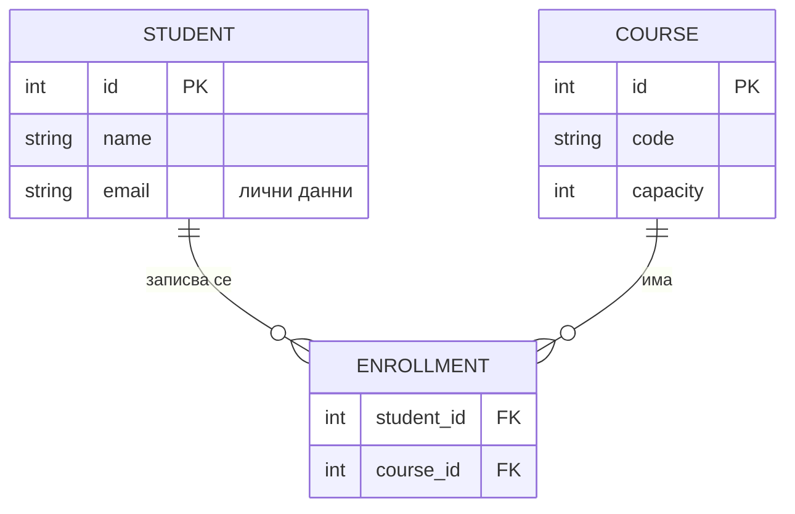

# Архитектурен документ — шаблон

::: goal
**За какво е този документ.** На изпита ще проектираш архитектурата на ново приложение и ще я опишеш точно в тази структура, включително с ER диаграма. През семестъра я упражняваш на части: всяка седмица добавя или променя един раздел в документа на **Университетската дигитална платформа**. Така решенията ти не изчезват след упражнението. Те живеят в документа и понякога трябва да ги преразгледаш.
:::

::: {.note title="Правила за писане"}
* **Кратко и проверимо.** Таблица и диаграма вместо абзац. Всяко твърдение трябва да може да се оспори.
* **Всяка диаграма има легенда** (какво са кутиите, какво са стрелките) и **заглавие**, което казва какво показва.
* **Числа, не прилагателни.** „p95 < 300 ms при 500 потребители“, не „бързо“.
* **Всяко решение има ADR.** Документът описва *какво е*, ADR-ите — *защо е така*.
:::

| § | Раздел | Какво съдържа | Упражнява се в |
|---|--------|---------------|----------------|
| 1 | Контекст и цели | Проблемът с думите на бизнеса · заинтересовани страни и какво ги боли | С1 |
| 2 | Движещи сили и ограничения | 3–5 движещи сили · ограничения, които не подлежат на избор | С1, С4 |
| 3 | Сценарии за качество | 3–6 измерими сценария (източник → стимул → отговор → мярка) | С7, С8 |
| 4 | Системен контекст (C4 ниво 1) | Системата като една кутия, хората и външните системи около нея | С3, С10 |
| 5 | Контейнери и компоненти (C4 ниво 2–3) | Какво се изпълнява отделно, кой с кого говори и как | С2, С3, С6, С9 |
| 6 | Модел на данните (ER) и собственост | ER диаграма · таблица „същност → собственик“ · лични данни | С1, С6, С8 |
| 7 | Ключови потоци | 1–3 сценария като последователност (кой вика кого, синхронно/асинхронно) | С4, С5 |
| 8 | Внедряване и граници на доверие | Къде се изпълнява всеки контейнер · мрежи · къде свършва доверието | С3, С6, С8 |
| 9 | Решения (ADR) | Списък с ADR-и: номер, заглавие, статус | всяка седмица |
| 10 | Рискове и технически дълг | Какво може да се обърка · какво отлагаме съзнателно | С7, С9, С10 |
| 11 | Речник | Термините на домейна (не техническите) | С1 → |

---

## 1. Контекст и цели
*3–5 изречения: какво прави системата, за кого и какъв проблем решава.*

| Заинтересована страна | Какво я интересува | Какво я боли днес |
|-----------------------|--------------------|-------------------|
| … | … | … |

## 2. Движещи сили и ограничения

| # | Движеща сила (изискване / атрибут на качеството) | Защо е важна | Източник |
|---|---------------------------------------------------|--------------|----------|
| D1 | … | … | заинтересована страна |

**Ограничения:** технологии, срокове, закони (напр. GDPR), екип, бюджет в €.

## 3. Сценарии за качество

| # | Атрибут | Източник | Стимул | Среда | Отговор | Мярка |
|---|---------|----------|--------|-------|---------|-------|
| Q1 | наличност | студент | записване | каталогът не отговаря | записването дава ясна грешка, разглеждането показва кеширан списък | 99% от заявките получават отговор < 3 s |

## 4. Системен контекст (C4 ниво 1)

```
[Студент] ──записва се──▶ ┌ Университетска платформа ┐ ──имейли──▶ [Пощенски сървър]
[Учебен отдел] ─────────▶ └──────────────────────────┘ ──оценки──▶ [LMS на партньор]
```

## 5. Контейнери и компоненти (C4 ниво 2–3)
*Една диаграма + таблица „контейнер → отговорност → технология → комуникация“.*

## 6. Модел на данните (ER) и собственост



| Същност | Собственик (модул/услуга) | Кой друг я чете и как | Лични данни? |
|---------|---------------------------|------------------------|--------------|
| STUDENT | … | … | да (име, имейл) |

::: why
**Защо колона „собственик“?** ER диаграмата казва *какви* са данните. Архитектурата казва *кой има право да ги променя*. Два компонента, които пишат в една таблица, са свързани, независимо колко чисто изглежда кодът им.
:::

## 7. Ключови потоци
*1–3 потока, напр. „записване на студент“: стрелки с номера, синхронно (──▶) или асинхронно (┄┄▶).*

## 8. Внедряване и граници на доверие
*Къде се изпълнява всеки контейнер. Начертай с пунктир границите на доверие и отбележи къде се проверява самоличността.*

## 9. Решения (ADR)

| ADR | Заглавие | Статус | Седмица |
|-----|----------|--------|---------|
| 001 | Правилата за записване живеят в модула за записване | прието | С1 |

## 10. Рискове и технически дълг

| Риск | Вероятност | Въздействие | Мярка / кога ще го адресираме |
|------|------------|-------------|-------------------------------|
| … | ниска/средна/висока | … | … |

## 11. Речник

| Термин | Значение в тази система |
|--------|-------------------------|
| Записване | Връзка студент–курс за текущия семестър |
