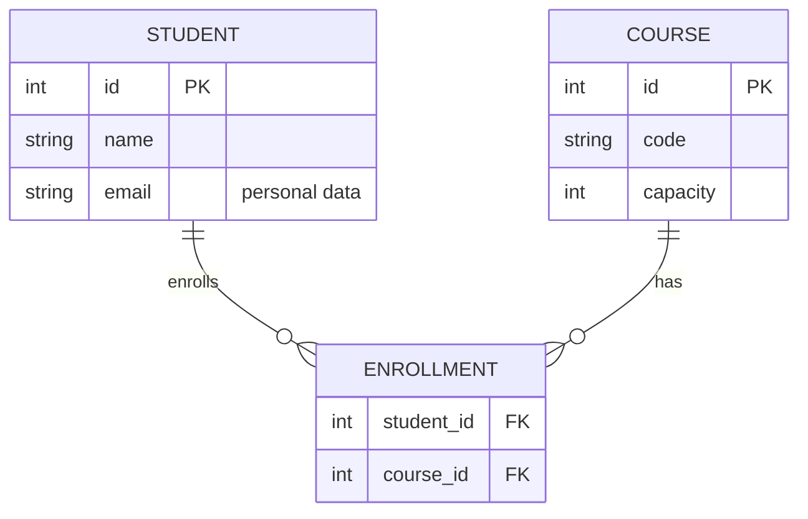

# Architecture document — template

::: goal
**What this document is for.** At the exam you will design the architecture of a new application and describe it in exactly this structure, including an ER diagram. During the semester you practise it piece by piece: every week adds or changes one section in the document of the **University Digital Platform**. So your decisions don't vanish after the lab. They live in the document, and sometimes you have to revisit them.
:::

::: {.note title="Writing rules"}
* **Short and checkable.** A table and a diagram instead of a paragraph. Every statement must be arguable.
* **Every diagram has a legend** (what the boxes are, what the arrows are) and a **title** that says what it shows.
* **Numbers, not adjectives.** "p95 < 300 ms at 500 users", not "fast".
* **Every decision has an ADR.** The document describes *what is*, the ADRs *why it is so*.
:::

| § | Section | What it contains | Practised in |
|---|---------|------------------|--------------|
| 1 | Context and goals | The problem in business words · stakeholders and what hurts them | W1 |
| 2 | Drivers and constraints | 3–5 drivers · constraints that are not a matter of choice | W1, W4 |
| 3 | Quality scenarios | 3–6 measurable scenarios (source → stimulus → response → measure) | W7, W8 |
| 4 | System context (C4 level 1) | The system as one box, the people and external systems around it | W3, W10 |
| 5 | Containers and components (C4 levels 2–3) | What runs separately, who talks to whom and how | W2, W3, W6, W9 |
| 6 | Data model (ER) and ownership | ER diagram · "entity → owner" table · personal data | W1, W6, W8 |
| 7 | Key flows | 1–3 scenarios as a sequence (who calls whom, sync/async) | W4, W5 |
| 8 | Deployment and trust boundaries | Where each container runs · networks · where trust ends | W3, W6, W8 |
| 9 | Decisions (ADRs) | A list of ADRs: number, title, status | every week |
| 10 | Risks and technical debt | What can go wrong · what we postpone on purpose | W7, W9, W10 |
| 11 | Glossary | The domain terms (not the technical ones) | W1 → |

---

## 1. Context and goals
*3–5 sentences: what the system does, for whom, and which problem it solves.*

| Stakeholder | What they care about | What hurts today |
|-------------|----------------------|------------------|
| … | … | … |

## 2. Drivers and constraints

| # | Driver (requirement / quality attribute) | Why it matters | Source |
|---|------------------------------------------|----------------|--------|
| D1 | … | … | stakeholder |

**Constraints:** technologies, deadlines, laws (e.g. GDPR), team, budget in €.

## 3. Quality scenarios

| # | Attribute | Source | Stimulus | Environment | Response | Measure |
|---|-----------|--------|----------|-------------|----------|---------|
| Q1 | availability | student | enrollment | the catalogue doesn't answer | enrollment gives a clear error, browsing shows a cached list | 99% of requests answered < 3 s |

## 4. System context (C4 level 1)

```
[Student] ──enrolls──▶ ┌ University Platform ┐ ──e-mails──▶ [Mail server]
[Registrar] ─────────▶ └─────────────────────┘ ──grades──▶ [Partner LMS]
```

## 5. Containers and components (C4 levels 2–3)
*One diagram + a table "container → responsibility → technology → communication".*

## 6. Data model (ER) and ownership



| Entity | Owner (module/service) | Who else reads it and how | Personal data? |
|--------|------------------------|---------------------------|----------------|
| STUDENT | … | … | yes (name, e-mail) |

::: why
**Why an "owner" column?** The ER diagram says *what* the data is. The architecture says *who may change it*. Two components that write to one table are coupled, however clean their code looks.
:::

## 7. Key flows
*1–3 flows, e.g. "enroll a student": numbered arrows, synchronous (──▶) or asynchronous (┄┄▶).*

## 8. Deployment and trust boundaries
*Where each container runs. Draw the trust boundaries dashed and mark where identity is checked.*

## 9. Decisions (ADRs)

| ADR | Title | Status | Week |
|-----|-------|--------|------|
| 001 | Enrollment rules live in the Enrollment module | accepted | W1 |

## 10. Risks and technical debt

| Risk | Likelihood | Impact | Mitigation / when we address it |
|------|------------|--------|---------------------------------|
| … | low/medium/high | … | … |

## 11. Glossary

| Term | Meaning in this system |
|------|------------------------|
| Enrollment | A student–course link for the current semester |
